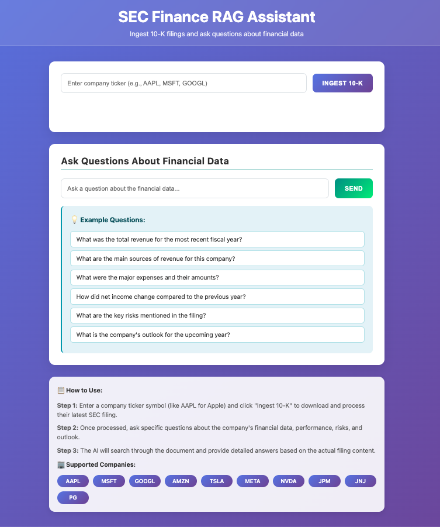

# SEC Finance RAG Assistant 🏦📊

A powerful Retrieval-Augmented Generation (RAG) application that automatically downloads SEC 10-K filings and enables intelligent querying of financial data using AI.


## 🌟 Features

- **Automatic SEC Filing Retrieval**: Enter a company ticker and automatically download the latest 10-K filing
- **Intelligent Financial Data Extraction**: Advanced parsing to extract meaningful financial information from SEC documents
- **AI-Powered Q&A**: Ask natural language questions about financial data and get detailed answers
- **Vector Search**: Uses OpenAI embeddings for semantic search through financial documents
- **Modern Web Interface**: Clean, responsive UI with real-time feedback
- **Support for Major Companies**: Pre-configured for popular tickers (AAPL, MSFT, GOOGL, etc.)

## 🚀 Demo



*Ask questions like: "What was the total revenue?" or "What are the main risk factors?"*

## 📋 Prerequisites

- Python 3.8 or higher
- OpenAI API key
- Internet connection (for downloading SEC filings)

## 🛠️ Installation

1. **Clone the repository**
   ```bash
   git clone https://github.com/yourusername/sec-finance-rag-assistant.git
   cd sec-finance-rag-assistant
   ```

2. **Create a virtual environment**
   ```bash
   python -m venv venv
   
   # On Windows
   venv\Scripts\activate
   
   # On macOS/Linux
   source venv/bin/activate
   ```

3. **Install dependencies**
   ```bash
   pip install -r requirements.txt
   ```

4. **Set up environment variables**
   
   Create a `.env` file in the project root:
   ```bash
   # Copy the example file
   cp env_example.sh .env
   ```
   
   Then edit the `.env` file with your actual values:
   ```bash
   # OpenAI API Configuration
   OPENAI_API_KEY=your_actual_openai_api_key_here
   
   # SEC API Configuration (Required by SEC.gov)
   USER_EMAIL=your-actual-email@example.com
   PROJECT_NAME=Your Actual Project Name
   ```

### SEC API Configuration (Required)

The SEC requires identification when accessing their API. You **must** update these values in your `.env` file:

```bash
# Required by SEC.gov for API access
USER_EMAIL=your-actual-email@example.com
PROJECT_NAME=Your Actual Project Name
```

**Important**: 
- Replace `your-actual-email@example.com` with your real email address
- Replace `Your Actual Project Name` with your actual project name
- The SEC requires this information for all API requests and will reject requests with placeholder values


## 🎯 Usage

1. **Start the application**
   ```bash
   python RAG_SEC_Finance_App.py
   ```

2. **Open your browser**
   Navigate to `http://127.0.0.1:8000`

3. **Ingest a 10-K filing**
   - Enter a company ticker (e.g., `AAPL`, `MSFT`, `GOOGL`)
   - Click "Ingest 10-K"
   - Wait for processing to complete

4. **Ask questions**
   - Use the query interface to ask questions about the financial data
   - Try example questions or ask your own

## 💡 Example Questions

- "What was the total revenue for the most recent fiscal year?"
- "What are the main sources of revenue for this company?"
- "What were the major expenses and their amounts?"
- "How did net income change compared to the previous year?"
- "What are the key risks mentioned in the filing?"
- "What is the company's outlook for the upcoming year?"

## 🏢 Supported Companies

The application comes pre-configured with CIK mappings for major companies:

| Ticker | Company             | Ticker | Company               |
|--------|---------------------|--------|-----------------------|
| AAPL   | Apple Inc.          | MSFT   | Microsoft Corporation |
| GOOGL  | Alphabet Inc.       | AMZN   | Amazon.com Inc.       |
| TSLA   | Tesla Inc.          | META   | Meta Platforms Inc.   |
| NVDA   | NVIDIA Corporation  | JPM    | JPMorgan Chase & Co.  |
| JNJ    | Johnson & Johnson   | PG     | Procter & Gamble Co.  |

*You can also use any valid SEC CIK number directly.*

## 🏗️ Architecture

```
┌─────────────────┐    ┌─────────────────┐    ┌─────────────────┐
│   Web Interface │    │   Flask API     │    │   SEC Data      │
│                 │◄──►│                 │◄──►│   Extractor     │
│   (HTML/JS)     │    │   (Python)      │    │                 │
└─────────────────┘    └─────────────────┘    └─────────────────┘
                              │
                              ▼
                       ┌─────────────────┐    ┌─────────────────┐
                       │   Document      │    │   RAG System    │
                       │   Processor     │◄──►│   (LlamaIndex)  │
                       │                 │    │                 │
                       └─────────────────┘    └─────────────────┘
                              │
                              ▼
                       ┌─────────────────┐
                       │   OpenAI API    │
                       │   (GPT-3.5 +    │
                       │   Embeddings)   │
                       └─────────────────┘
```

## 📁 Project Structure

```
sec-finance-rag-assistant/
├── RAG_SEC_Finance_App.py      # Main application file
├── templates/
│   └── index.html              # Web interface
├── work/                       # Generated files (auto-created)
│   ├── index/                  # Vector index storage
│   └── company_folders/        # Processed documents
├── uploads/                    # Downloaded SEC filings (auto-created)
├── requirements.txt            # Python dependencies
├── env_example.sh              # Environment variables template
├── .gitignore                  # Git ignore rules
├── README.md                   # This file
└── setup_script.py             # Package setup configuration
```


## 🔧 Configuration

### Environment Variables

- `OPENAI_API_KEY`: Your OpenAI API key (required)
- `USER_EMAIL`: Your email address (required by SEC.gov)
- `PROJECT_NAME`: Your project name (required by SEC.gov)

### Customization

You can modify the `COMPANY_CIK_MAP` in `RAG_SEC_Finance_App.py` to add more companies:

```python
COMPANY_CIK_MAP = {
    'AAPL': '0000320193',
    'YOURNEW': '0000123456',  # Add your company here
    # ... more companies
}
```

## 🐛 Troubleshooting

### Common Issues

1. **"No OpenAI API key found"**
   - Make sure you've set the `OPENAI_API_KEY` environment variable
   - Check that your API key is valid and has sufficient credits

2. **"SEC API request failed"**
   - Verify you've set a real email address in `USER_EMAIL`
   - Ensure `PROJECT_NAME` is set to an actual project name
   - Check your internet connection

3. **"No 10-K filing found"**
   - Verify the company ticker is correct
   - Some companies may not have recent 10-K filings

4. **Slow processing**
   - Large 10-K documents can take time to process
   - Check your internet connection for downloading files

5. **Import errors**
   - Make sure you've installed all requirements: `pip install -r requirements.txt`
   - Verify you're using Python 3.8+

### Logging

The application logs detailed information to `logs/sec_rag.log`. Check this file for debugging information.

## 🤝 Contributing

### Development Setup

1. Fork the repository
2. Create your feature branch (`git checkout -b feature/AmazingFeature`)
3. Commit your changes (`git commit -m 'Add some AmazingFeature'`)
4. Push to the branch (`git push origin feature/AmazingFeature`)
5. Open a Pull Request

## 📄 License

This project is licensed under the MIT License 

## 🙏 Acknowledgments

- [LlamaIndex](https://github.com/run-llama/llama_index) for the RAG framework
- [OpenAI](https://openai.com/) for GPT-3.5 and embeddings
- [SEC.gov](https://www.sec.gov/) for providing free access to financial data
- [Flask](https://flask.palletsprojects.com/) for the web framework

## 🔮 Future Features

- [ ] Support for other SEC filings (10-Q, 8-K)
- [ ] Batch processing multiple companies
- [ ] Financial data visualization
- [ ] Export query results
- [ ] Integration with financial databases
- [ ] Advanced filtering and search options

---

**⭐ If you find this project helpful, please consider giving it a star!**